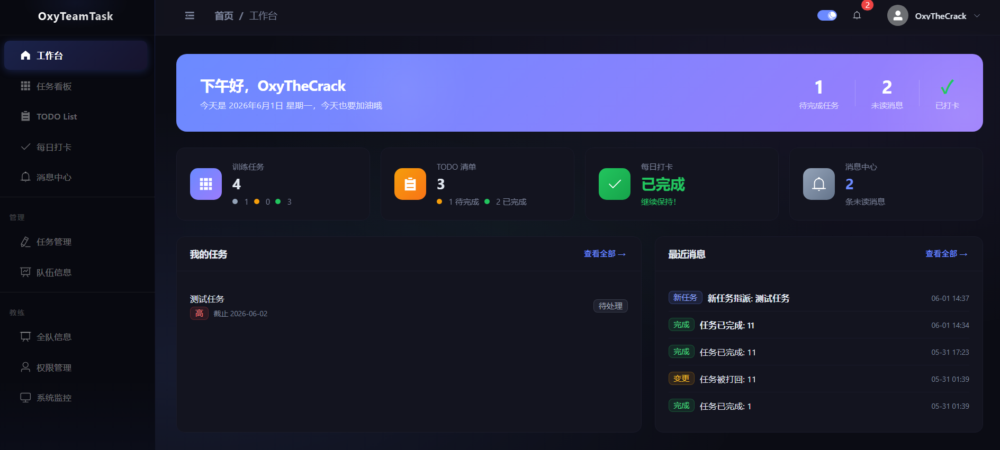
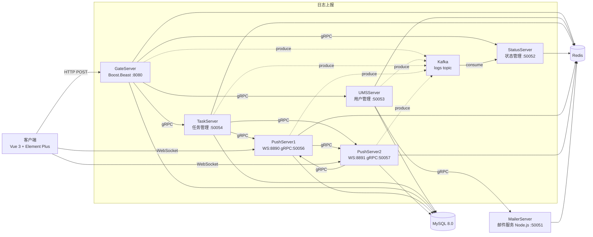

<!-- AUTO-GENERATED -->

<div align="right">

[English](README-en.md) · 中文

</div>

<h1 align="center">OxyTeamTask</h1>
<p align="center">
  <strong>训练团队分布式训练任务协同管理系统</strong>
  <br />
  <em>微服务架构 · gRPC 通信 · WebSocket 实时推送 · 角色权限控制</em>
</p>

<p align="center">
  <a href="#快速开始"></a>
  <a href="LICENSE"></a>
</p>

<p align="center">
  
  
  
  
  
  
</p>

<p align="center">
  
  
  
  
  
  
  
</p>

<p align="center">
  
  
</p>

<p align="center">
  
</p>

<p align = "center">
  <a href="assets/Dashboard.png">
    
  </a>
  <br/>
</p>

---

## 功能特性

| 功能 | 描述 |
|---|---|
| **微服务架构** | 6 个独立服务（5 个 C++ / 1 个 Node.js）通过 gRPC 通信，各自拥有独立的数据库访问和连接池 |
| **实时推送通知** | 基于 WebSocket 的消息推送，支持跨节点转发、自动重连和 Redis 离线消息缓存 |
| **角色权限控制** | 三级角色（队员、队长、教练），在前端路由守卫和后端 RPC 处理器双重强制执行 |
| **独立任务追踪** | 共享任务的每个执行人独立状态追踪，支持批量 SQL 查询和状态回退 |
| **分布式并发安全** | Redis 分布式锁配合 Lua 原子脚本，保障登录令牌、消息推送和未读计数的一致性 |
| **负载均衡推送服务器** | 基于线段树算法的 O(log n) PushServer 分配，按连接数均衡，支持水平扩展 |
| **Kafka 日志管道** | Kafka 作为日志上报主通道，各服务器异步写入，StatusServer 消费聚合，gRPC 保留为兜底 |

---

## 快速开始

### 环境要求

- C++17 编译器（GCC 9+ / Clang 10+）
- CMake 3.16+
- Node.js 18+
- MySQL 8.0
- Redis 6.0+
- Boost、Protobuf、gRPC、hiredis、mysqlcppconn、librdkafka（系统库）

### 安装依赖

```bash
# 系统包（Ubuntu/Debian）
sudo apt install libboost-all-dev libprotobuf-dev protobuf-compiler \
  libgrpc++-dev protobuf-compiler-grpc libhiredis-dev libmysqlcppconn-dev librdkafka-dev

# 前端依赖
cd Client && npm install

# 邮件服务依赖
cd MailerServer && npm install
```

### 配置

```bash
# 初始化数据库
mysql -u root -p < sql/user.sql
mysql -u root -p oxytasks < sql/task.sql
mysql -u root -p oxytasks < sql/task_assignments.sql
mysql -u root -p oxytasks < sql/todo_list.sql
mysql -u root -p oxytasks < sql/messages.sql

# 编辑各服务器目录下的 config.ini，配置 MySQL/Redis 连接信息
# 编辑 MailerServer/config.json，配置 SMTP 邮件发送凭证
# 编辑 Client/config.json，配置 GateServer 主机和端口
```

### 启动

```bash
# 构建所有 C++ 服务器
bash script/build_all.sh

# 按正确顺序启动所有服务
bash script/start_all.sh

# 启动前端开发服务器
cd Client && npm run dev
```

---

## 使用方法

### API 请求（通过 GateServer）

所有前端请求通过 GateServer 转发（HTTP POST → gRPC 翻译）：

```bash
# 登录
curl -X POST http://localhost:8080/user_login \
  -H "Content-Type: application/json" \
  -d '{"email":"user@example.com","password":"hashed_password"}'

# 获取任务列表
curl -X POST http://localhost:8080/task_list \
  -H "Content-Type: application/json" \
  -d '{"uid":0,"status":-1,"assigned_to":"0"}'

# 每日打卡
curl -X POST http://localhost:8080/checkin \
  -H "Content-Type: application/json" \
  -d '{"uid":1}'
```

### 直接 gRPC 调用（绕过 GateServer）

```bash
# 直接通过 TaskServer 查询任务
grpcurl -plaintext -d '{"uid":1}' localhost:50054 message.TaskService/ListTasks
```

### WebSocket 推送客户端

```javascript
import { connectPushServer } from '@/utils/pushClient'

// 登录后连接推送服务器
connectPushServer(host, port, uid, token)

// 监听实时通知
onMessage('notify', (data) => { /* 处理通知 */ })
onMessage('task_new', (data) => { /* 处理新任务 */ })
onMessage('kicked', (data) => { /* 处理会话踢出 */ })
```

---

## 架构



**启动顺序**：StatusServer → UMSServer → TaskServer → PushServer1 → PushServer2 → GateServer

---

## API 接口

所有接口均为 `POST` 请求，通过 `http://localhost:8080` 的 GateServer 转发。成功响应格式为 `{ "error": 0 }`。

### 认证相关

| 接口 | 说明 |
|---|---|
| `POST /get_verify_code` | 请求邮箱验证码 |
| `POST /user_register` | 用户注册（需要验证码） |
| `POST /user_login` | 用户登录（返回 uid、token、推送服务器信息） |
| `POST /user_resetpass` | 通过验证码重置密码 |

### 任务管理

| 接口 | 说明 |
|---|---|
| `POST /task_create` | 创建任务并分配执行人 |
| `POST /task_update` | 更新任务（uid=0 全局更新，uid>0 更新指定执行人状态） |
| `POST /task_delete` | 删除任务 |
| `POST /task_get` | 获取任务详情（含各执行人状态） |
| `POST /task_list` | 按条件筛选任务列表 |

### 待办与打卡

| 接口 | 说明 |
|---|---|
| `POST /todo_add` | 添加待办事项（支持优先级、截止日期） |
| `POST /todo_list` | 获取待办列表 |
| `POST /todo_update` | 更新待办事项 |
| `POST /todo_delete` | 删除待办事项 |
| `POST /checkin` | 每日打卡（已打卡返回错误码 3001） |
| `POST /checkin_list` | 按日期范围查询打卡记录 |

### 消息管理

| 接口 | 说明 |
|---|---|
| `POST /msg_list` | 获取消息列表（含未读数） |
| `POST /msg_read` | 标记消息已读 |
| `POST /msg_delete` | 删除消息 |

### 管理功能（仅教练）

| 接口 | 说明 |
|---|---|
| `POST /user_list_pending` | 查看待审批用户列表 |
| `POST /user_approve` | 审批通过用户（设置角色和队伍） |
| `POST /user_reject` | 拒绝用户注册 |
| `POST /user_set_role` | 修改用户角色/队伍 |
| `POST /user_list_all` | 查看所有活跃用户 |
| `POST /user_update_team` | 更新用户队伍归属 |
| `POST /monitor/query_logs` | 查询服务日志 |
| `POST /monitor/server_status` | 查询服务器健康状态 |

---

## 项目结构

```
OxyTasks/
├── GateServer/          # HTTP 网关（Boost.Beast），JSON→gRPC 协议翻译
│   ├── config.ini       # 服务端口、下游服务地址、数据库/Redis 配置
│   ├── message.proto    # Protobuf 服务定义
│   ├── LogicSystem.cpp  # HTTP 路由注册和请求处理逻辑
│   └── ...              # GrpcClient、MySQL/Redis 连接池、日志模块
├── UMSServer/           # 用户管理服务（gRPC :50053）
│   └── UMSGrpcServiceImpl.cpp  # 注册、登录、密码重置、管理员操作
├── TaskServer/          # 任务/待办/打卡服务（gRPC :50054）
│   └── TaskGrpcServiceImpl.cpp # 任务增删改查、待办管理、打卡、定时提醒
├── StatusServer/        # 服务注册中心、负载均衡、日志聚合（:50052）
│   └── SegmentTree.cpp  # O(log n) PushServer 分配线段树算法
├── PushServer/          # WebSocket 推送 + gRPC（:8890 WS, :50056 gRPC）
│   └── PushGrpcServiceImpl.cpp # 消息推送、消息持久化
├── PushServer2/         # 第二个 PushServer 实例（:8891 WS, :50057 gRPC）
├── MailerServer/        # 邮件验证服务（Node.js, gRPC :50051）
│   ├── server.js        # gRPC 服务入口
│   └── email.js         # Nodemailer SMTP 邮件发送
├── Client/              # Vue 3 单页应用前端
│   ├── src/views/       # 14 个视图组件（认证、工作台、任务看板等）
│   ├── src/stores/      # Pinia 状态管理（用户认证、应用主题）
│   ├── src/api/         # Axios API 封装层
│   └── src/utils/       # WebSocket 客户端、SHA-256 加密工具
├── jsoncpp/             # 内嵌的 jsoncpp 库
├── docs/                # 调试日志、设计文档
├── sql/                 # 数据库建表脚本
│   ├── user.sql         # 用户表
│   ├── task.sql         # 任务表
│   ├── task_assignments.sql  # 任务分配表
│   ├── todo_list.sql    # 待办表
│   └── messages.sql     # 消息表
├── script/              # 运维脚本
│   ├── build_all.sh     # 一键构建所有 C++ 服务器
│   ├── start_all.sh     # 按正确顺序启动服务
│   ├── stop_all.sh      # 优雅停止所有服务
│   └── clear_logs.sh    # 清除所有服务器日志
```

---

## 技术栈

### 前端

| 技术 | 用途 |
|---|---|
| Vue 3（Composition API） | UI 框架，使用 `<script setup>` 语法 |
| Vue Router 4 | Hash 路由，兼容 Electron 打包 |
| Pinia | 状态管理（用户认证、应用主题，持久化到 localStorage） |
| Element Plus | UI 组件库，图标自动导入 |
| Axios | HTTP 客户端，自动注入认证头 |
| Vite 5 | 构建工具，开发服务器代理到 GateServer |

### 后端（C++）

| 技术 | 用途 |
|---|---|
| C++17 | 5 个微服务的核心语言 |
| Boost.Beast / Asio | HTTP 服务器（GateServer）和 WebSocket 服务器（PushServer） |
| gRPC + Protobuf | 服务间通信（5 个服务共 35 个 RPC 方法） |
| hiredis | Redis 客户端，用于缓存、分布式锁、会话管理 |
| MySQL Connector/C++ | 数据库访问，带连接池 |
| jsoncpp（内嵌） | HTTP 请求/响应的 JSON 解析 |
| librdkafka | Kafka C/C++ 客户端，用于日志上报管道 |

### 后端（Node.js）

| 技术 | 用途 |
|---|---|
| @grpc/grpc-js | MailerService 的 gRPC 服务器 |
| Nodemailer | SMTP 邮件发送（验证码） |
| ioredis | Redis 客户端，用于验证码存储 |

### 基础设施

| 技术 | 用途 |
|---|---|
| MySQL 8.0 | 持久化存储（用户、任务、待办、打卡、消息） |
| Redis 6.0+ | 会话令牌、分布式锁、消息缓存、未读计数、日志聚合 |
| CMake | 所有 C++ 服务器的构建系统 |
| Kafka | 日志上报消息队列，解耦生产端和消费端 |

---

## 配置说明

每个 C++ 服务器都有一个 `config.ini` 配置文件，包含以下配置段：

| 配置段 | 关键配置项 | 说明 |
|---|---|---|
| `[ServerName]` | host, port | 本服务器监听地址 |
| `[MySQL]` | host, port, user, password, dbName, poolSize | 数据库连接池配置 |
| `[Redis]` | host, port, password, poolSize | Redis 连接池配置 |
| `[Log]` | level, flushInterval | 日志配置 |
| `[StatusServer]` | host, port | StatusServer 地址（用于心跳上报） |

MailerServer 使用 `config.json` 配置 SMTP、MySQL 和 Redis 凭证。

Client 使用项目根目录的 `config.json` 配置 GateServer 主机和端口。

---

## 角色系统

| 角色 | 等级 | 权限 |
|---|---|---|
| **队员** | 0 | 查看/完成分配的任务、个人待办、每日打卡 |
| **队长** | 1 | 队员权限 + 创建任务、管理队伍、查看队伍进度 |
| **教练** | 2 | 队长权限 + 审批用户、管理所有队伍、系统监控 |

新注册用户状态为 `待审批`，需教练审批通过后方可登录。

---

## 参与贡献

1. Fork 本仓库
2. 创建功能分支（`git checkout -b feature/amazing`）
3. 提交更改（`git commit -m 'feat: add amazing feature'`）
4. 推送到远程分支（`git push origin feature/amazing`）
5. 创建 Pull Request

---

## 许可证

[MIT](LICENSE)
