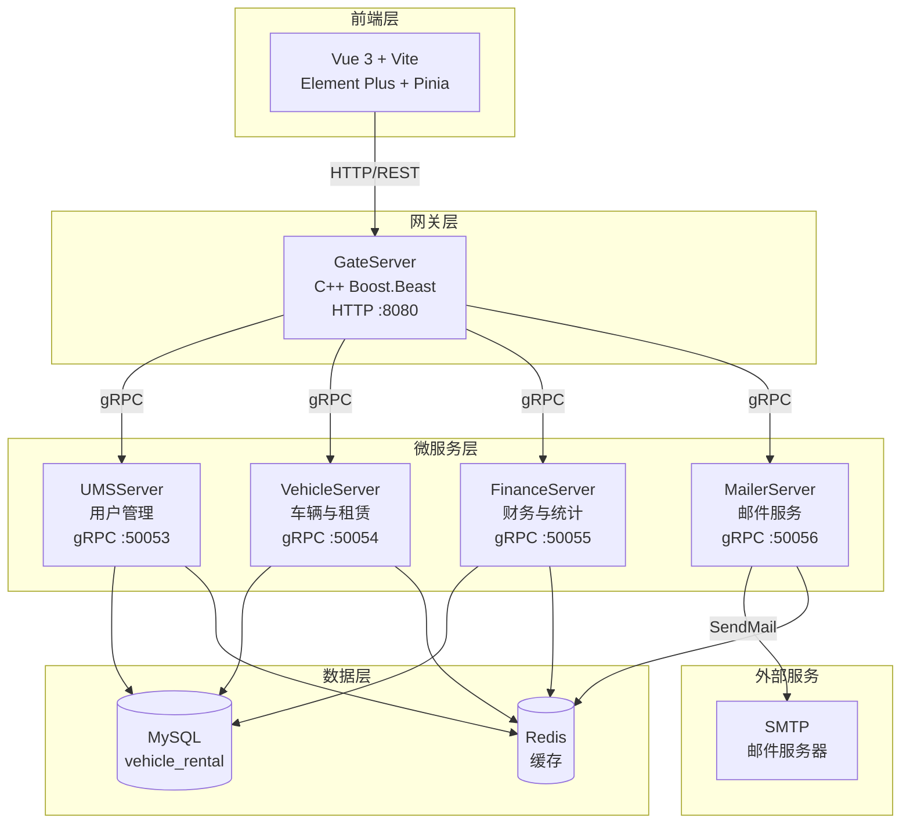
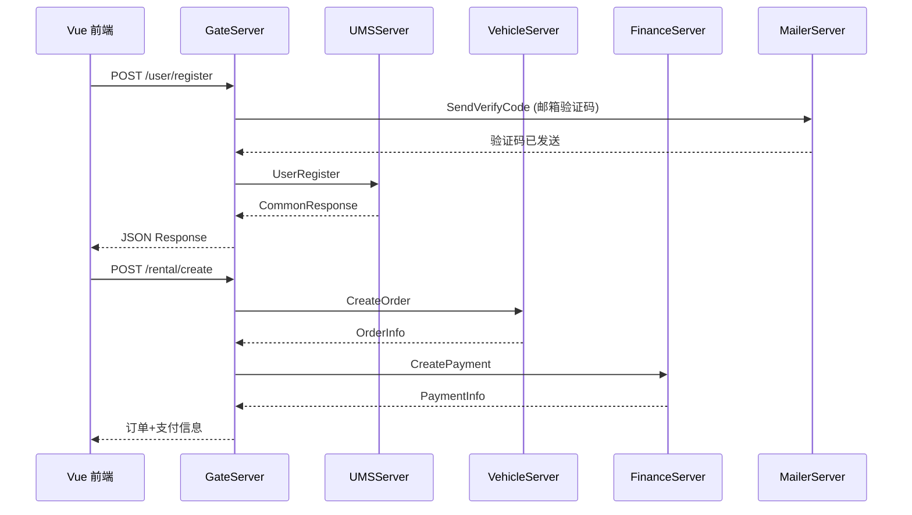
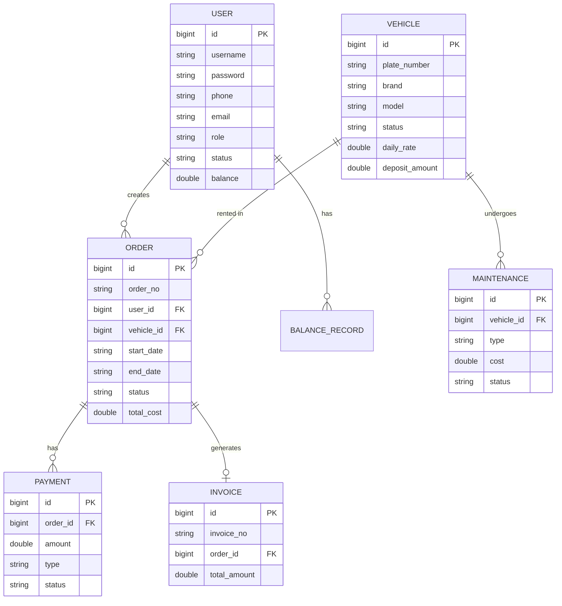

<h1 align="center">OxyRent</h1>
<p align="center">
  <strong>车辆租赁管理系统 — 覆盖车队管理、租赁订单、维保记录、财务结算全生命周期</strong>
  <br />
  <em>微服务架构 · C++ gRPC · Vue 3 · MySQL · Redis · Docker</em>
</p>

<p align="center">
  <a href="#快速开始"></a>
  <a href="LICENSE"></a>
</p>

<p align="center">
  
  
  
  
  
  
  
  
  
</p>

<p align="center">
  中文 · <a href="READMEs/README-en.md">English</a> · <a href="READMEs/README-ja.md">日本語</a> · <a href="READMEs/README-ru.md">Русский</a>
</p>

---

## 功能特性

| 功能 | 说明 |
|---|---|
| 车辆管理 | 车辆增删改查、状态追踪（可用/已租/维保中）、品牌筛选 |
| 租赁订单 | 在线预订、取车/还车、续租、取消、自动计算费用与罚金 |
| 维保管理 | 维保记录创建与跟踪，完成后自动恢复车辆为可用状态 |
| 财务结算 | 支付记录、发票生成、收入统计、车辆利用率分析 |
| 用户管理 | 三种角色（管理员/员工/客户）、余额充值、个人资料管理 |
| 数据看板 | 实时统计概览：用户数、车辆数、订单状态、营收趋势 |

## 快速开始

### 前置条件

- Docker 20.10+
- Docker Compose 2.0+
- **本地部署需在 Linux 环境下运行**（推荐 Ubuntu 22.04+）。macOS / Windows 用户请通过 Docker 或 WSL2 运行。

### 启动服务

```bash
git clone https://github.com/OxyTheCrack/OxyPark.git
cd OxyPark
docker-compose up -d
```

### 访问系统

```bash
# 前端页面
http://localhost:3000

# API 网关
http://localhost:8080
```

### 脚本管理

```bash
# 一键构建所有服务
./script/build_all.sh

# 启动所有服务
./script/start_all.sh

# 停止所有服务
./script/stop_all.sh
```

## 使用示例

### 用户注册

```bash
curl -X POST http://localhost:8080/user/register \
  -H "Content-Type: application/json" \
  -d '{"username": "testuser", "password": "123456", "email": "test@example.com"}'
```

### 用户登录

```bash
curl -X POST http://localhost:8080/user/login \
  -H "Content-Type: application/json" \
  -d '{"username": "testuser", "password": "123456"}'
```

### 获取车辆列表

```bash
curl -X GET http://localhost:8080/vehicle/list?page=1&page_size=10
```

### 创建租赁订单

```bash
curl -X POST http://localhost:8080/rental/create \
  -H "Content-Type: application/json" \
  -H "Authorization: Bearer <token>" \
  -d '{"user_id": 1, "vehicle_id": 1, "start_date": "2026-07-01", "end_date": "2026-07-07"}'
```

## 系统架构



### 请求流转



### 数据模型



## 配置说明

各服务通过 INI 配置文件进行配置，挂载到容器内 `/etc/server/config.ini`。

### 网关配置 (gate-config.ini)

| 配置项 | 说明 | 示例值 |
|---|---|---|
| `GateServer.host` | 监听地址 | `0.0.0.0` |
| `GateServer.port` | 监听端口 | `8080` |
| `MySQL.host` | MySQL 地址 | `mysql` |
| `Redis.host` | Redis 地址 | `redis` |
| `UMSServer.host` | 用户服务地址 | `ums-server` |
| `UMSServer.port` | 用户服务端口 | `50053` |
| `VehicleServer.host` | 车辆服务地址 | `vehicle-server` |
| `VehicleServer.port` | 车辆服务端口 | `50054` |
| `FinanceServer.host` | 财务服务地址 | `finance-server` |
| `FinanceServer.port` | 财务服务端口 | `50055` |
| `MailerServer.host` | 邮件服务地址 | `mailer-server` |
| `MailerServer.port` | 邮件服务端口 | `50056` |

## API 接口

### 公开接口（无需认证）

| 方法 | 路径 | 说明 |
|---|---|---|
| POST | `/user/register` | 用户注册 |
| POST | `/user/login` | 用户登录 |

### 用户接口

| 方法 | 路径 | 说明 | 角色 |
|---|---|---|---|
| GET | `/user/profile` | 获取个人信息 | 全部 |
| PUT | `/user/profile` | 更新个人信息 | 全部 |
| GET | `/user/list` | 用户列表 | 管理员 |
| PUT | `/user/status` | 更新用户状态 | 管理员 |
| PUT | `/user/role` | 更新用户角色 | 管理员 |
| GET | `/balance` | 查询余额 | 全部 |
| POST | `/balance/topup` | 余额充值 | 员工/管理员 |

### 车辆接口

| 方法 | 路径 | 说明 | 角色 |
|---|---|---|---|
| GET | `/vehicle/list` | 车辆列表 | 全部 |
| GET | `/vehicle/detail` | 车辆详情 | 全部 |
| POST | `/vehicle/add` | 添加车辆 | 管理员 |
| PUT | `/vehicle/update` | 更新车辆 | 管理员 |
| DELETE | `/vehicle/delete` | 删除车辆 | 管理员 |

### 租赁接口

| 方法 | 路径 | 说明 | 角色 |
|---|---|---|---|
| POST | `/rental/create` | 创建订单 | 全部 |
| GET | `/rental/list` | 订单列表 | 全部 |
| GET | `/rental/detail` | 订单详情 | 全部 |
| POST | `/rental/pickup` | 取车 | 员工/管理员 |
| POST | `/rental/return` | 还车 | 员工/管理员 |
| POST | `/rental/renew` | 续租 | 全部 |
| POST | `/rental/cancel` | 取消订单 | 全部 |

### 维保接口

| 方法 | 路径 | 说明 | 角色 |
|---|---|---|---|
| GET | `/maintenance/list` | 维保列表 | 员工/管理员 |
| POST | `/maintenance/add` | 添加维保 | 员工/管理员 |
| PUT | `/maintenance/update` | 更新维保 | 员工/管理员 |
| DELETE | `/maintenance/delete` | 删除维保 | 员工/管理员 |

### 财务接口

| 方法 | 路径 | 说明 | 角色 |
|---|---|---|---|
| POST | `/payment/create` | 创建支付 | 管理员 |
| GET | `/payment/list` | 支付列表 | 管理员 |
| POST | `/invoice/generate` | 生成发票 | 管理员 |
| GET | `/stats/overview` | 统计概览 | 管理员 |
| GET | `/stats/revenue` | 营收统计 | 管理员 |

## 项目结构

```
OxyPark/
├── Client/                  # Vue 3 前端
│   ├── src/
│   │   ├── api/             # HTTP 请求封装
│   │   ├── layout/          # 布局组件
│   │   ├── router/          # 路由配置
│   │   ├── stores/          # Pinia 状态管理
│   │   └── views/           # 页面视图
│   │       ├── auth/        # 登录、注册
│   │       ├── dashboard/   # 工作台
│   │       ├── vehicle/     # 车辆管理
│   │       ├── rental/      # 租赁管理
│   │       ├── maintenance/ # 维保管理
│   │       ├── finance/     # 财务管理
│   │       ├── stats/       # 统计报表
│   │       └── user/        # 用户管理
│   └── Dockerfile
├── GateServer/              # HTTP 网关 (C++ Boost.Beast)
├── UMSServer/               # 用户管理服务 (C++ gRPC)
├── VehicleServer/           # 车辆与租赁服务 (C++ gRPC)
├── FinanceServer/           # 财务统计服务 (C++ gRPC)
├── MailerServer/            # 邮件服务 (Node.js gRPC, Planned)
├── docker/                  # 各服务配置文件
├── sql/                     # 数据库初始化脚本
├── script/                  # 构建/启停脚本
├── jsoncpp/                 # JsonCpp 依赖
├── docker-compose.yml       # 容器编排
└── DESIGN.md                # 设计规范 (Noir Elegance)
```

## 技术栈

### 前端

| 技术 | 用途 |
|---|---|
| Vue 3 | UI 框架 |
| Vite | 构建工具 |
| Element Plus | 组件库 |
| Pinia | 状态管理 |
| Vue Router | 路由管理 |
| Axios | HTTP 客户端 |
| ECharts | 数据可视化 |

### 后端

| 技术 | 用途 |
|---|---|
| C++17 | 服务端语言 |
| Boost.Beast | HTTP 服务器 (GateServer) |
| gRPC | 服务间通信 |
| Protobuf | 序列化协议 |
| Hiredis | Redis 客户端 |
| MySQL Connector/C++ | 数据库驱动 |
| JsonCpp | JSON 解析 |

### 基础设施

| 技术 | 用途 |
|---|---|
| MySQL | 关系型数据库 |
| Redis | 缓存与会话管理 |
| Docker | 容器化部署 |
| Docker Compose | 多容器编排 |
| Ubuntu 22.04 | 容器基础镜像与推荐运行环境 |
| CMake | C++ 构建系统 |

## 部署

### Docker Compose（推荐）

```bash
docker-compose up -d
```

启动后包含以下服务：

| 服务 | 端口 | 说明 |
|---|---|---|
| vue3-client | 3000 | 前端页面 |
| gate-server | 8080 | API 网关 |
| ums-server | 50053 | 用户管理 |
| vehicle-server | 50054 | 车辆与租赁 |
| finance-server | 50055 | 财务统计 |
| mysql | 3307 | 数据库 |
| redis | 6380 | 缓存 |

### 手动构建

```bash
# 构建所有 C++ 服务
./script/build_all.sh

# 启动所有服务
./script/start_all.sh

# 停止所有服务
./script/stop_all.sh
```

## 贡献

1. Fork 本仓库
2. 创建功能分支 (`git checkout -b feature/your-feature`)
3. 提交更改 (`git commit -m 'feat: add your feature'`)
4. 推送分支 (`git push origin feature/your-feature`)
5. 提交 Pull Request

## 许可证

[MIT](LICENSE)
