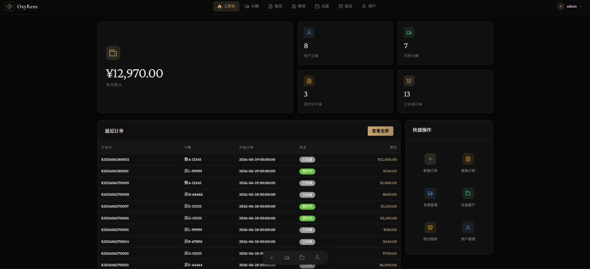
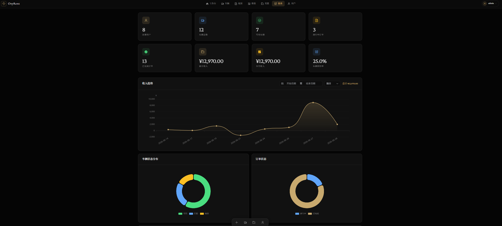
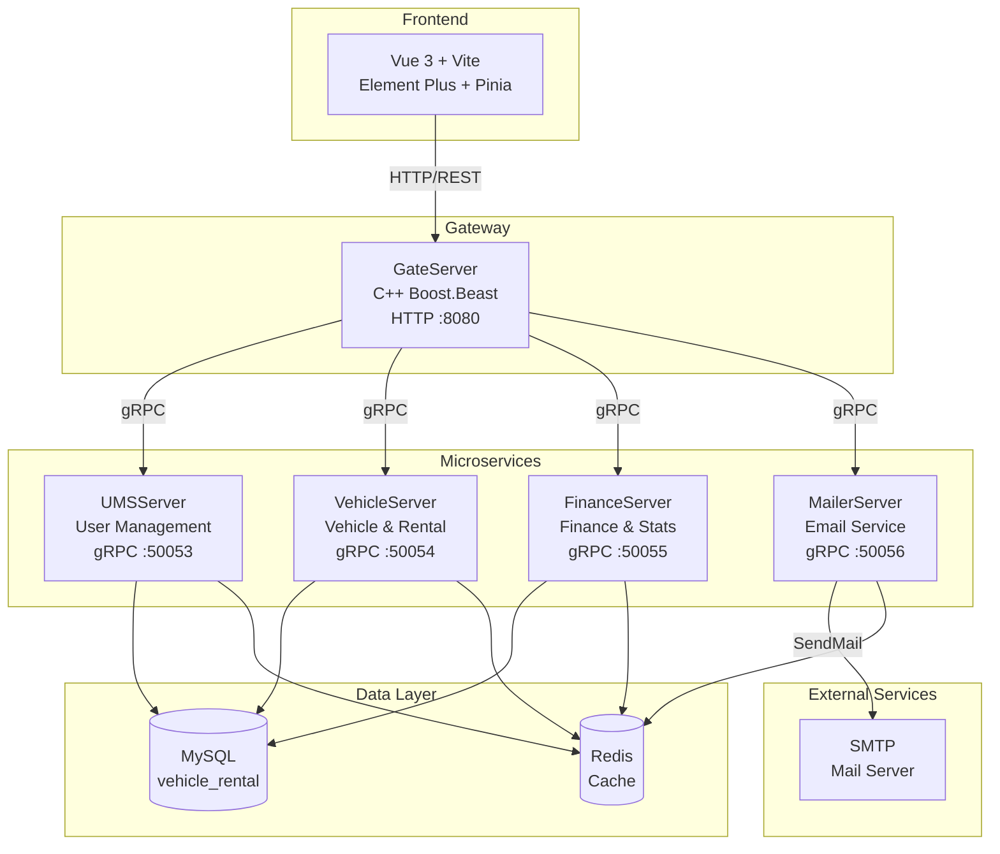
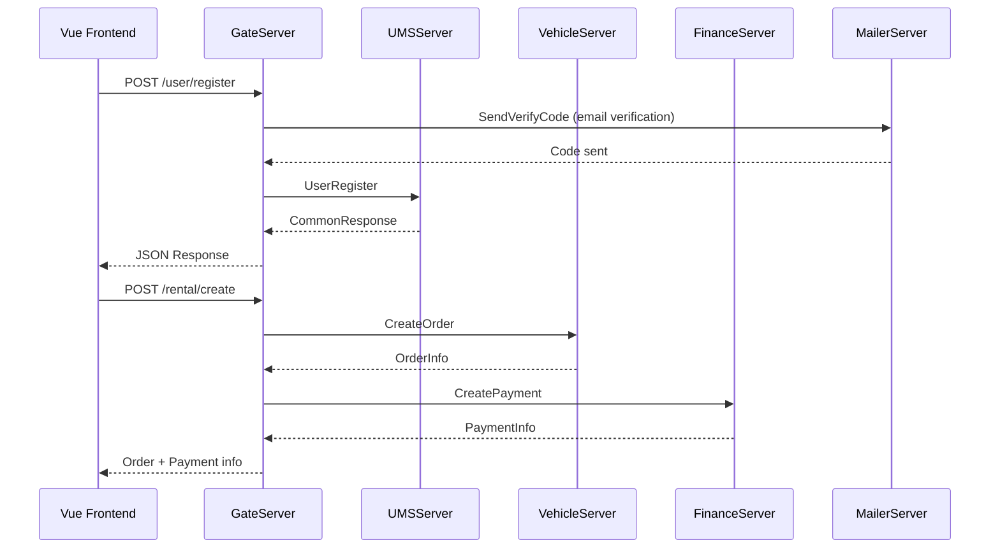
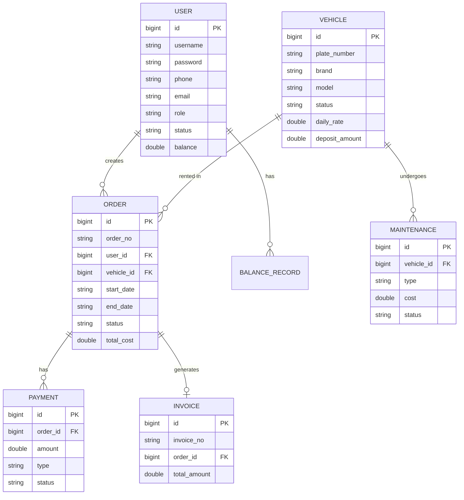

<h1 align="center">OxyRent</h1>
<p align="center">
  <strong>Vehicle Rental Management System — Fleet inventory, rental orders, maintenance, and billing in one platform</strong>
  <br />
  <em>Microservices · C++ gRPC · Vue 3 · MySQL · Redis · Docker</em>
</p>

<p align="center">
  <a href="#quick-start"></a>
  <a href="../LICENSE"></a>
</p>

<p align="center">
  
  
  
  
  
  
  
  
  
</p>

<p align="center">
  <a href="../README.md">中文</a> · English · <a href="README-ja.md">日本語</a> · <a href="README-ru.md">Русский</a>
</p>

<p align="center">
  
  <br />
  <em>Dashboard</em>
</p>
<p align="center">
  
  <br />
  <em>Statistics</em>
</p>

<p align="center">
  
</p>

---

## Features

| Feature | Description |
|---|---|
| Vehicle Management | CRUD operations, status tracking (available/rented/maintenance), brand filtering |
| Rental Orders | Online booking, pickup/return, renewal, cancellation, auto cost & penalty calculation |
| Maintenance | Create and track maintenance records; auto-restore vehicle status on completion |
| Billing | Payment records, invoice generation, revenue statistics, utilization analysis |
| User Management | Three roles (admin/staff/customer), balance top-up, profile management |
| Dashboard | Real-time stats: user count, fleet size, order status, revenue trends |

## Quick Start

### Prerequisites

- Docker 20.10+
- Docker Compose 2.0+
- **Local deployment requires a Linux environment** (Ubuntu 22.04+ recommended). macOS / Windows users should run via Docker or WSL2.

### Start Services

```bash
git clone https://github.com/KieranGao/OxyRent.git
cd OxyRent
docker-compose up -d
```

### Access the System

```bash
# Frontend
http://localhost:3000

# API Gateway
http://localhost:8080
```

### Script Management

```bash
# Build all services
./script/build_all.sh

# Start all services
./script/start_all.sh

# Stop all services
./script/stop_all.sh
```

## Usage Examples

### User Registration

```bash
curl -X POST http://localhost:8080/user/register \
  -H "Content-Type: application/json" \
  -d '{"username": "testuser", "password": "123456", "email": "test@example.com"}'
```

### User Login

```bash
curl -X POST http://localhost:8080/user/login \
  -H "Content-Type: application/json" \
  -d '{"username": "testuser", "password": "123456"}'
```

### List Vehicles

```bash
curl -X GET http://localhost:8080/vehicle/list?page=1&page_size=10
```

### Create Rental Order

```bash
curl -X POST http://localhost:8080/rental/create \
  -H "Content-Type: application/json" \
  -H "Authorization: Bearer <token>" \
  -d '{"user_id": 1, "vehicle_id": 1, "start_date": "2026-07-01", "end_date": "2026-07-07"}'
```

## Architecture



### Request Flow



### Data Model



## Configuration

Each service uses INI config files mounted to `/etc/server/config.ini` inside the container.

### Gateway Config (gate-config.ini)

| Key | Description | Example |
|---|---|---|
| `GateServer.host` | Listen address | `0.0.0.0` |
| `GateServer.port` | Listen port | `8080` |
| `MySQL.host` | MySQL address | `mysql` |
| `Redis.host` | Redis address | `redis` |
| `UMSServer.host` | User service address | `ums-server` |
| `UMSServer.port` | User service port | `50053` |
| `VehicleServer.host` | Vehicle service address | `vehicle-server` |
| `VehicleServer.port` | Vehicle service port | `50054` |
| `FinanceServer.host` | Finance service address | `finance-server` |
| `FinanceServer.port` | Finance service port | `50055` |
| `MailerServer.host` | Mailer service address | `mailer-server` |
| `MailerServer.port` | Mailer service port | `50056` |

## API

### Public Endpoints (No Auth)

| Method | Path | Description |
|---|---|---|
| POST | `/user/register` | Register user |
| POST | `/user/login` | User login |

### User Endpoints

| Method | Path | Description | Role |
|---|---|---|---|
| GET | `/user/profile` | Get profile | All |
| PUT | `/user/profile` | Update profile | All |
| GET | `/user/list` | List users | Admin |
| PUT | `/user/status` | Update user status | Admin |
| PUT | `/user/role` | Update user role | Admin |
| GET | `/balance` | Get balance | All |
| POST | `/balance/topup` | Top up balance | Staff/Admin |

### Vehicle Endpoints

| Method | Path | Description | Role |
|---|---|---|---|
| GET | `/vehicle/list` | List vehicles | All |
| GET | `/vehicle/detail` | Vehicle detail | All |
| POST | `/vehicle/add` | Add vehicle | Admin |
| PUT | `/vehicle/update` | Update vehicle | Admin |
| DELETE | `/vehicle/delete` | Delete vehicle | Admin |

### Rental Endpoints

| Method | Path | Description | Role |
|---|---|---|---|
| POST | `/rental/create` | Create order | All |
| GET | `/rental/list` | List orders | All |
| GET | `/rental/detail` | Order detail | All |
| POST | `/rental/pickup` | Pickup vehicle | Staff/Admin |
| POST | `/rental/return` | Return vehicle | Staff/Admin |
| POST | `/rental/renew` | Renew order | All |
| POST | `/rental/cancel` | Cancel order | All |

### Maintenance Endpoints

| Method | Path | Description | Role |
|---|---|---|---|
| GET | `/maintenance/list` | List records | Staff/Admin |
| POST | `/maintenance/add` | Add record | Staff/Admin |
| PUT | `/maintenance/update` | Update record | Staff/Admin |
| DELETE | `/maintenance/delete` | Delete record | Staff/Admin |

### Finance Endpoints

| Method | Path | Description | Role |
|---|---|---|---|
| POST | `/payment/create` | Create payment | Admin |
| GET | `/payment/list` | List payments | Admin |
| POST | `/invoice/generate` | Generate invoice | Admin |
| GET | `/stats/overview` | Stats overview | Admin |
| GET | `/stats/revenue` | Revenue stats | Admin |

## Project Structure

```
OxyRent/
├── Client/                  # Vue 3 Frontend
│   ├── src/
│   │   ├── api/             # HTTP request wrappers
│   │   ├── layout/          # Layout components
│   │   ├── router/          # Route config
│   │   ├── stores/          # Pinia state management
│   │   └── views/           # Page views
│   │       ├── auth/        # Login, Register
│   │       ├── dashboard/   # Workspace
│   │       ├── vehicle/     # Vehicle management
│   │       ├── rental/      # Rental management
│   │       ├── maintenance/ # Maintenance management
│   │       ├── finance/     # Finance management
│   │       ├── stats/       # Statistics
│   │       └── user/        # User management
│   └── Dockerfile
├── GateServer/              # HTTP Gateway (C++ Boost.Beast)
├── UMSServer/               # User Management (C++ gRPC)
├── VehicleServer/           # Vehicle & Rental (C++ gRPC)
├── FinanceServer/           # Finance & Stats (C++ gRPC)
├── MailerServer/            # Email Service (Node.js gRPC, Planned)
├── docker/                  # Service config files
├── sql/                     # Database init scripts
├── script/                  # Build/start/stop scripts
├── jsoncpp/                 # JsonCpp dependency
├── docker-compose.yml       # Container orchestration
└── DESIGN.md                # Design system (Noir Elegance)
```

## Tech Stack

### Frontend

| Technology | Purpose |
|---|---|
| Vue 3 | UI framework |
| Vite | Build tool |
| Element Plus | Component library |
| Pinia | State management |
| Vue Router | Routing |
| Axios | HTTP client |
| ECharts | Data visualization |

### Backend

| Technology | Purpose |
|---|---|
| C++17 | Server language |
| Boost.Beast | HTTP server (GateServer) |
| gRPC | Inter-service communication |
| Protobuf | Serialization protocol |
| Hiredis | Redis client |
| MySQL Connector/C++ | Database driver |
| JsonCpp | JSON parsing |

### Infrastructure

| Technology | Purpose |
|---|---|
| MySQL | Relational database |
| Redis | Caching & session management |
| Docker | Containerization |
| Docker Compose | Multi-container orchestration |
| Ubuntu 22.04 | Container base image & recommended runtime |
| CMake | C++ build system |

## Deployment

### Docker Compose (Recommended)

```bash
docker-compose up -d
```

Services included:

| Service | Port | Description |
|---|---|---|
| vue3-client | 3000 | Frontend |
| gate-server | 8080 | API Gateway |
| ums-server | 50053 | User Management |
| vehicle-server | 50054 | Vehicle & Rental |
| finance-server | 50055 | Finance & Stats |
| mysql | 3307 | Database |
| redis | 6380 | Cache |

### Manual Build

```bash
# Build all C++ services
./script/build_all.sh

# Start all services
./script/start_all.sh

# Stop all services
./script/stop_all.sh
```

## Contributing

1. Fork the repository
2. Create a feature branch (`git checkout -b feature/your-feature`)
3. Commit your changes (`git commit -m 'feat: add your feature'`)
4. Push to the branch (`git push origin feature/your-feature`)
5. Open a Pull Request

## License

[MIT](../LICENSE)
