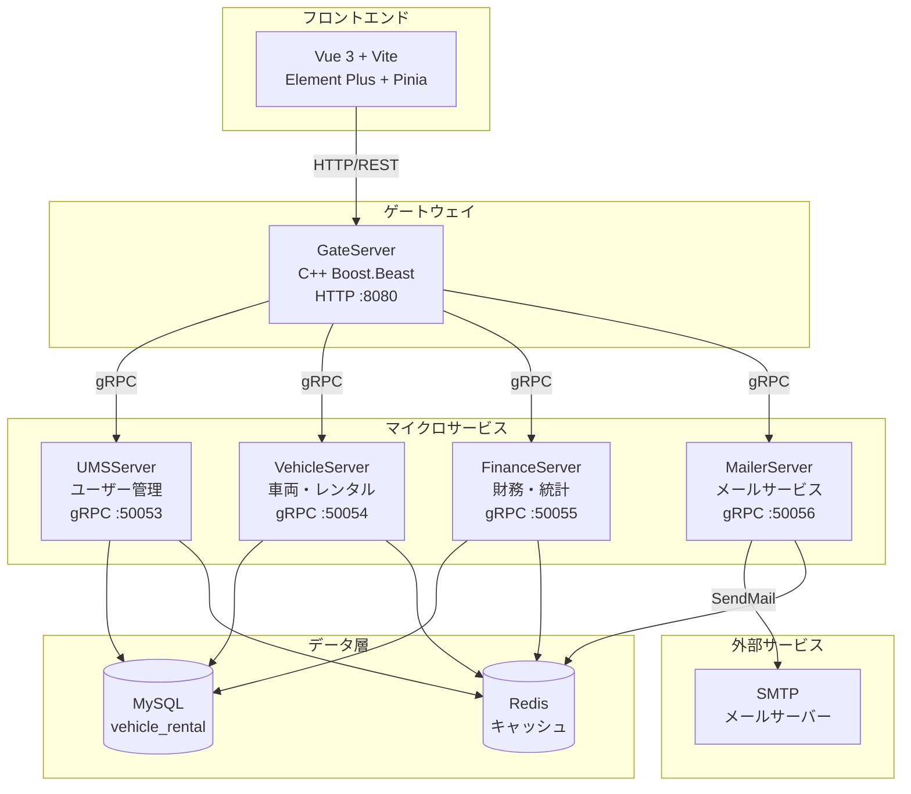
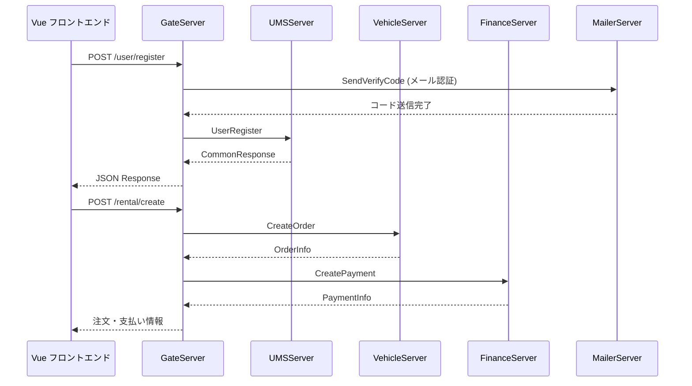
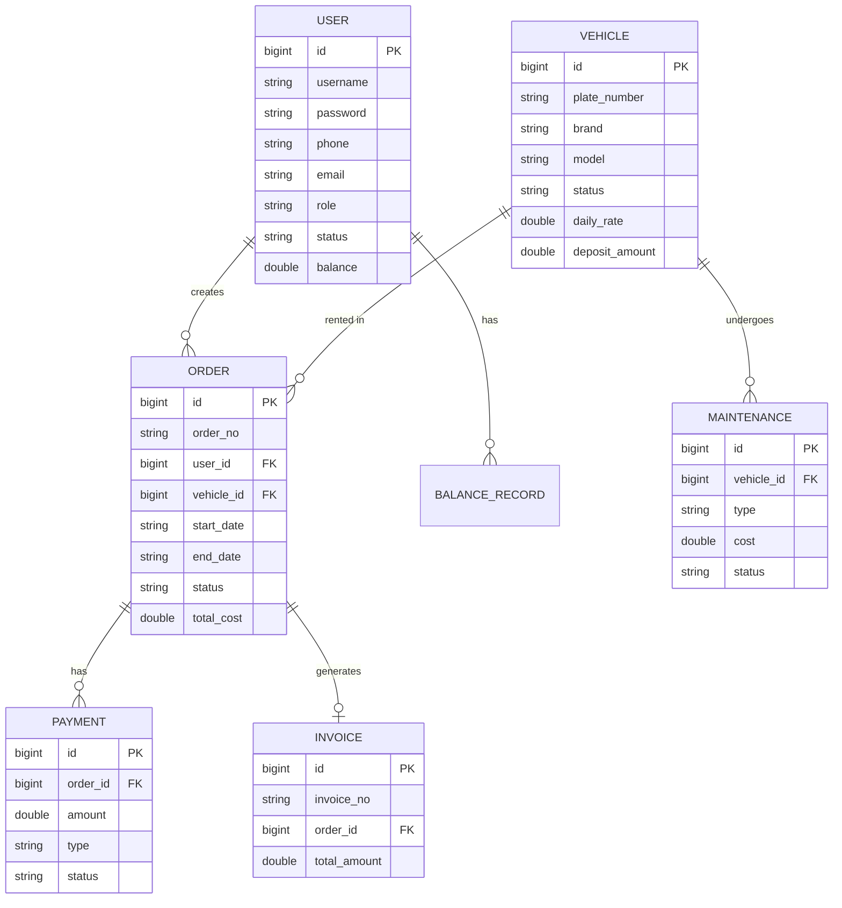

<h1 align="center">OxyRent</h1>
<p align="center">
  <strong>車両レンタル管理システム — 車隊管理、レンタル注文、メンテナンス、請求を統合</strong>
  <br />
  <em>マイクロサービス · C++ gRPC · Vue 3 · MySQL · Redis · Docker</em>
</p>

<p align="center">
  <a href="#クイックスタート"></a>
  <a href="../LICENSE"></a>
</p>

<p align="center">
  
  
  
  
  
  
  
  
  
</p>

<p align="center">
  <a href="../README.md">中文</a> · <a href="README-en.md">English</a> · 日本語 · <a href="README-ru.md">Русский</a>
</p>

<p align="center">
  
  <br />
  <em>ワークスペース</em>
</p>
<p align="center">
  
  <br />
  <em>統計ページ</em>
</p>

<p align="center">
  
</p>

---

## 機能

| 機能 | 説明 |
|---|---|
| 車両管理 | CRUD操作、ステータス追跡（利用可能/レンタル中/メンテナンス中）、ブランド検索 |
| レンタル注文 | オンライン予約、受渡し/返却、更新、キャンセル、自動料金・延滞金計算 |
| メンテナンス | メンテナンス記録の作成と追跡、完了時に車両ステータスを自動復元 |
| 請求 | 支払い記録、請求書生成、収益統計、稼働率分析 |
| ユーザー管理 | 3つの役割（管理者/スタッフ/顧客）、残高チャージ、プロフィール管理 |
| ダッシュボード | リアルタイム統計：ユーザー数、車両数、注文ステータス、収益トレンド |

## クイックスタート

### 前提条件

- Docker 20.10+
- Docker Compose 2.0+
- **ローカルデプロイにはLinux環境が必要です**（Ubuntu 22.04+推奨）。macOS / WindowsユーザーはDockerまたはWSL2経由で実行してください。

### サービス起動

```bash
git clone https://github.com/KieranGao/OxyRent.git
cd OxyRent
docker-compose up -d
```

### システムへのアクセス

```bash
# フロントエンド
http://localhost:3000

# APIゲートウェイ
http://localhost:8080
```

### スクリプト管理

```bash
# 全サービスをビルド
./script/build_all.sh

# 全サービスを起動
./script/start_all.sh

# 全サービスを停止
./script/stop_all.sh
```

## 使用例

### ユーザー登録

```bash
curl -X POST http://localhost:8080/user/register \
  -H "Content-Type: application/json" \
  -d '{"username": "testuser", "password": "123456", "email": "test@example.com"}'
```

### ユーザーログイン

```bash
curl -X POST http://localhost:8080/user/login \
  -H "Content-Type: application/json" \
  -d '{"username": "testuser", "password": "123456"}'
```

### 車両一覧取得

```bash
curl -X GET http://localhost:8080/vehicle/list?page=1&page_size=10
```

### レンタル注文作成

```bash
curl -X POST http://localhost:8080/rental/create \
  -H "Content-Type: application/json" \
  -H "Authorization: Bearer <token>" \
  -d '{"user_id": 1, "vehicle_id": 1, "start_date": "2026-07-01", "end_date": "2026-07-07"}'
```

## アーキテクチャ



### リクエストフロー



### データモデル



## 設定

各サービスはINI設定ファイルを使用し、コンテナ内 `/etc/server/config.ini` にマウントされます。

### ゲートウェイ設定 (gate-config.ini)

| キー | 説明 | 例 |
|---|---|---|
| `GateServer.host` | リッスンアドレス | `0.0.0.0` |
| `GateServer.port` | リッスンポート | `8080` |
| `MySQL.host` | MySQLアドレス | `mysql` |
| `Redis.host` | Redisアドレス | `redis` |
| `UMSServer.host` | ユーザーサービスアドレス | `ums-server` |
| `UMSServer.port` | ユーザーサービスポート | `50053` |
| `VehicleServer.host` | 車両サービスアドレス | `vehicle-server` |
| `VehicleServer.port` | 車両サービスポート | `50054` |
| `FinanceServer.host` | 財務サービスアドレス | `finance-server` |
| `FinanceServer.port` | 財務サービスポート | `50055` |
| `MailerServer.host` | メールサービスアドレス | `mailer-server` |
| `MailerServer.port` | メールサービスポート | `50056` |

## API

### 公開エンドポイント（認証不要）

| メソッド | パス | 説明 |
|---|---|---|
| POST | `/user/register` | ユーザー登録 |
| POST | `/user/login` | ログイン |

### ユーザーエンドポイント

| メソッド | パス | 説明 | 役割 |
|---|---|---|---|
| GET | `/user/profile` | プロフィール取得 | 全て |
| PUT | `/user/profile` | プロフィール更新 | 全て |
| GET | `/user/list` | ユーザー一覧 | 管理者 |
| POST | `/balance/topup` | 残高チャージ | スタッフ/管理者 |

### 車両エンドポイント

| メソッド | パス | 説明 | 役割 |
|---|---|---|---|
| GET | `/vehicle/list` | 車両一覧 | 全て |
| GET | `/vehicle/detail` | 車両詳細 | 全て |
| POST | `/vehicle/add` | 車両追加 | 管理者 |
| PUT | `/vehicle/update` | 車両更新 | 管理者 |
| DELETE | `/vehicle/delete` | 車両削除 | 管理者 |

### レンタルエンドポイント

| メソッド | パス | 説明 | 役割 |
|---|---|---|---|
| POST | `/rental/create` | 注文作成 | 全て |
| GET | `/rental/list` | 注文一覧 | 全て |
| POST | `/rental/pickup` | 車両受渡し | スタッフ/管理者 |
| POST | `/rental/return` | 車両返却 | スタッフ/管理者 |
| POST | `/rental/renew` | レンタル更新 | 全て |
| POST | `/rental/cancel` | 注文キャンセル | 全て |

## プロジェクト構造

```
OxyRent/
├── Client/                  # Vue 3 フロントエンド
├── GateServer/              # HTTPゲートウェイ (C++ Boost.Beast)
├── UMSServer/               # ユーザー管理 (C++ gRPC)
├── VehicleServer/           # 車両・レンタル (C++ gRPC)
├── FinanceServer/           # 財務・統計 (C++ gRPC)
├── MailerServer/            # メールサービス (Node.js gRPC, 予定)
├── docker/                  # サービス設定ファイル
├── sql/                     # DB初期化スクリプト
├── script/                  # ビルド/起動/停止スクリプト
├── docker-compose.yml       # コンテナオーケストレーション
└── DESIGN.md                # デザインシステム (Noir Elegance)
```

## 技術スタック

### フロントエンド

| 技術 | 用途 |
|---|---|
| Vue 3 | UIフレームワーク |
| Vite | ビルドツール |
| Element Plus | コンポーネントライブラリ |
| Pinia | 状態管理 |
| Vue Router | ルーティング |
| Axios | HTTPクライアント |
| ECharts | データ可視化 |

### バックエンド

| 技術 | 用途 |
|---|---|
| C++17 | サーバー言語 |
| Boost.Beast | HTTPサーバー (GateServer) |
| gRPC | サービス間通信 |
| Protobuf | シリアライゼーション |
| Hiredis | Redisクライアント |
| MySQL Connector/C++ | DBドライバー |
| JsonCpp | JSON解析 |

### インフラ

| 技術 | 用途 |
|---|---|
| MySQL | RDB |
| Redis | キャッシュ・セッション管理 |
| Docker | コンテナ化 |
| Docker Compose | マルチコンテナオーケストレーション |
| Ubuntu 22.04 | コンテナベースイメージ・推奨ランタイム |
| CMake | C++ビルドシステム |

## デプロイ

### Docker Compose（推奨）

```bash
docker-compose up -d
```

| サービス | ポート | 説明 |
|---|---|---|
| vue3-client | 3000 | フロントエンド |
| gate-server | 8080 | APIゲートウェイ |
| ums-server | 50053 | ユーザー管理 |
| vehicle-server | 50054 | 車両・レンタル |
| finance-server | 50055 | 財務・統計 |
| mysql | 3307 | データベース |
| redis | 6380 | キャッシュ |

## コントリビュート

1. リポジトリをFork
2. 機能ブランチを作成 (`git checkout -b feature/your-feature`)
3. 変更をコミット (`git commit -m 'feat: add your feature'`)
4. ブランチをプッシュ (`git push origin feature/your-feature`)
5. Pull Requestを作成

## ライセンス

[MIT](../LICENSE)
