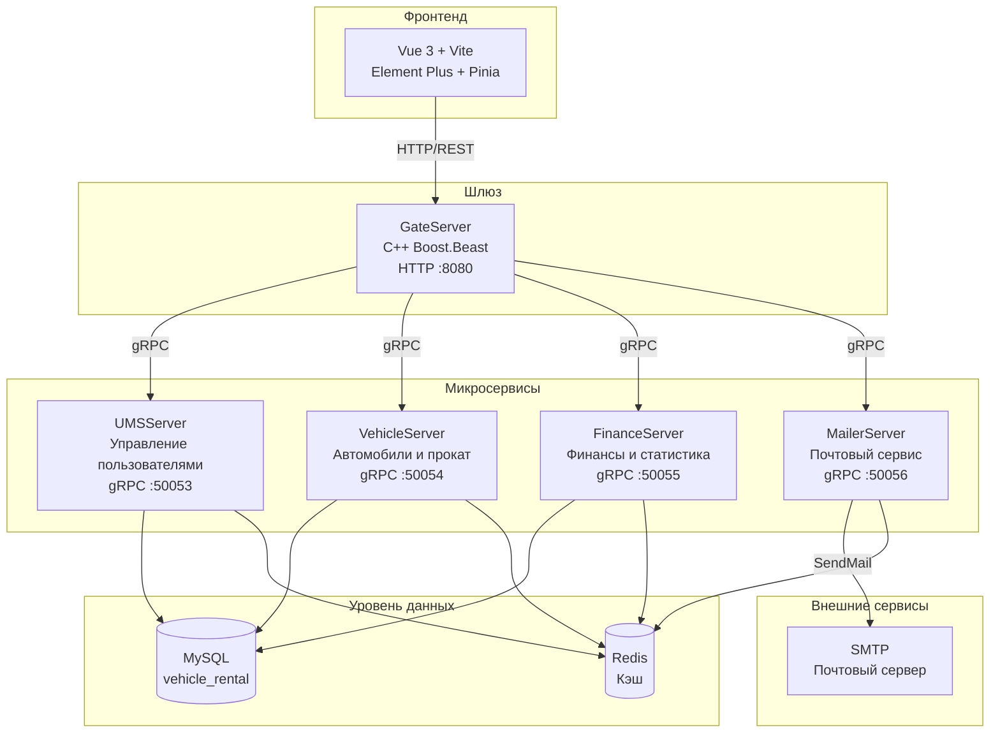
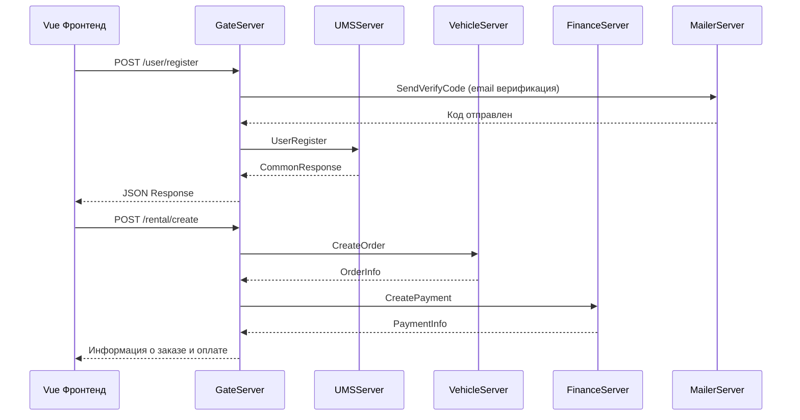
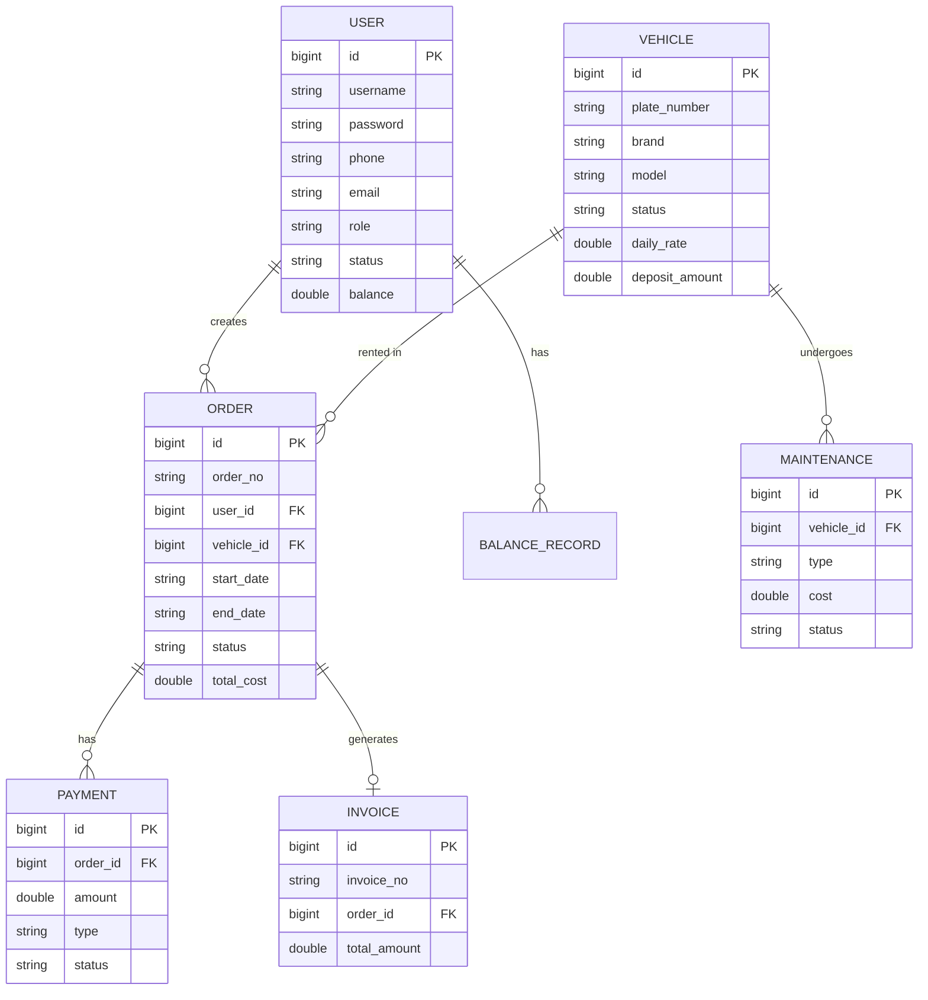

<h1 align="center">OxyRent</h1>
<p align="center">
  <strong>Система управления прокатом автомобилей — управление автопарком, заказами, обслуживанием и_billingом</strong>
  <br />
  <em>Микросервисы · C++ gRPC · Vue 3 · MySQL · Redis · Docker</em>
</p>

<p align="center">
  <a href="#быстрый-старт"></a>
  <a href="../LICENSE"></a>
</p>

<p align="center">
  
  
  
  
  
  
  
  
  
</p>

<p align="center">
  <a href="../README.md">中文</a> · <a href="README-en.md">English</a> · <a href="README-ja.md">日本語</a> · Русский
</p>

---

## Возможности

| Функция | Описание |
|---|---|
| Управление автомобилями | CRUD-операции, отслеживание статуса (доступен/арендован/на обслуживании), фильтрация по бренду |
| Заказы проката | Онлайн-бронирование, получение/возврат, продление, отмена, автоматический расчёт стоимости и штрафов |
| Обслуживание | Создание и отслеживание записей ТО, автоматическое восстановление статуса автомобиля |
| Финансы | Записи платежей, генерация счетов, статистика доходов, анализ_utilization |
| Управление пользователями | Три роли (администратор/сотрудник/клиент), пополнение баланса, управление профилем |
| Панель мониторинга | Статистика в реальном времени: количество пользователей, автопарк, статус заказов, тренды доходов |

## Быстрый старт

### Предварительные требования

- Docker 20.10+
- Docker Compose 2.0+
- **Локальное развёртывание требует Linux-среды** (рекомендуется Ubuntu 22.04+). Пользователи macOS / Windows должны запускать через Docker или WSL2.

### Запуск сервисов

```bash
git clone https://github.com/KieranGao/OxyRent.git
cd OxyRent
docker-compose up -d
```

### Доступ к системе

```bash
# Фронтенд
http://localhost:3000

# API-шлюз
http://localhost:8080
```

### Управление скриптами

```bash
# Сборка всех сервисов
./script/build_all.sh

# Запуск всех сервисов
./script/start_all.sh

# Остановка всех сервисов
./script/stop_all.sh
```

## Примеры использования

### Регистрация пользователя

```bash
curl -X POST http://localhost:8080/user/register \
  -H "Content-Type: application/json" \
  -d '{"username": "testuser", "password": "123456", "email": "test@example.com"}'
```

### Авторизация

```bash
curl -X POST http://localhost:8080/user/login \
  -H "Content-Type: application/json" \
  -d '{"username": "testuser", "password": "123456"}'
```

### Список автомобилей

```bash
curl -X GET http://localhost:8080/vehicle/list?page=1&page_size=10
```

### Создание заказа проката

```bash
curl -X POST http://localhost:8080/rental/create \
  -H "Content-Type: application/json" \
  -H "Authorization: Bearer <token>" \
  -d '{"user_id": 1, "vehicle_id": 1, "start_date": "2026-07-01", "end_date": "2026-07-07"}'
```

## Архитектура



### Поток запросов



### Модель данных



## Конфигурация

Каждый сервис использует INI-файлы конфигурации, монтируемые в `/etc/server/config.ini` внутри контейнера.

### Конфигурация шлюза (gate-config.ini)

| Ключ | Описание | Пример |
|---|---|---|
| `GateServer.host` | Адрес прослушивания | `0.0.0.0` |
| `GateServer.port` | Порт прослушивания | `8080` |
| `MySQL.host` | Адрес MySQL | `mysql` |
| `Redis.host` | Адрес Redis | `redis` |
| `UMSServer.host` | Адрес сервиса пользователей | `ums-server` |
| `UMSServer.port` | Порт сервиса пользователей | `50053` |
| `VehicleServer.host` | Адрес сервиса автомобилей | `vehicle-server` |
| `VehicleServer.port` | Порт сервиса автомобилей | `50054` |
| `FinanceServer.host` | Адрес финансового сервиса | `finance-server` |
| `FinanceServer.port` | Порт финансового сервиса | `50055` |
| `MailerServer.host` | Адрес почтового сервиса | `mailer-server` |
| `MailerServer.port` | Порт почтового сервиса | `50056` |

## API

### Публичные эндпоинты (без авторизации)

| Метод | Путь | Описание |
|---|---|---|
| POST | `/user/register` | Регистрация пользователя |
| POST | `/user/login` | Авторизация |

### Эндпоинты пользователей

| Метод | Путь | Описание | Роль |
|---|---|---|---|
| GET | `/user/profile` | Получить профиль | Все |
| PUT | `/user/profile` | Обновить профиль | Все |
| GET | `/user/list` | Список пользователей | Администратор |
| POST | `/balance/topup` | Пополнить баланс | Сотрудник/Администратор |

### Эндпоинты автомобилей

| Метод | Путь | Описание | Роль |
|---|---|---|---|
| GET | `/vehicle/list` | Список автомобилей | Все |
| GET | `/vehicle/detail` | Детали автомобиля | Все |
| POST | `/vehicle/add` | Добавить автомобиль | Администратор |
| PUT | `/vehicle/update` | Обновить автомобиль | Администратор |
| DELETE | `/vehicle/delete` | Удалить автомобиль | Администратор |

### Эндпоинты проката

| Метод | Путь | Описание | Роль |
|---|---|---|---|
| POST | `/rental/create` | Создать заказ | Все |
| GET | `/rental/list` | Список заказов | Все |
| POST | `/rental/pickup` | Получить автомобиль | Сотрудник/Администратор |
| POST | `/rental/return` | Вернуть автомобиль | Сотрудник/Администратор |
| POST | `/rental/renew` | Продлить аренду | Все |
| POST | `/rental/cancel` | Отменить заказ | Все |

## Структура проекта

```
OxyRent/
├── Client/                  # Vue 3 фронтенд
├── GateServer/              # HTTP-шлюз (C++ Boost.Beast)
├── UMSServer/               # Управление пользователями (C++ gRPC)
├── VehicleServer/           # Автомобили и прокат (C++ gRPC)
├── FinanceServer/           # Финансы и статистика (C++ gRPC)
├── MailerServer/            # Почтовый сервис (Node.js gRPC, Planned)
├── docker/                  # Файлы конфигурации сервисов
├── sql/                     # Скрипты инициализации БД
├── script/                  # Скрипты сборки/запуска/остановки
├── docker-compose.yml       # Оркестрация контейнеров
└── DESIGN.md                # Дизайн-система (Noir Elegance)
```

## Технологический стек

### Фронтенд

| Технология | Назначение |
|---|---|
| Vue 3 | UI-фреймворк |
| Vite | Инструмент сборки |
| Element Plus | Библиотека компонентов |
| Pinia | Управление состоянием |
| Vue Router | Маршрутизация |
| Axios | HTTP-клиент |
| ECharts | Визуализация данных |

### Бэкенд

| Технология | Назначение |
|---|---|
| C++17 | Серверный язык |
| Boost.Beast | HTTP-сервер (GateServer) |
| gRPC | Межсервисное взаимодействие |
| Protobuf | Протокол сериализации |
| Hiredis | Клиент Redis |
| MySQL Connector/C++ | Драйвер БД |
| JsonCpp | Парсинг JSON |

### Инфраструктура

| Технология | Назначение |
|---|---|
| MySQL | Реляционная БД |
| Redis | Кэширование и управление сессиями |
| Docker | Контейнеризация |
| Docker Compose | Оркестрация контейнеров |
| Ubuntu 22.04 | Базовый образ контейнера и рекомендуемая среда |
| CMake | Система сборки C++ |

## Развёртывание

### Docker Compose (рекомендуется)

```bash
docker-compose up -d
```

| Сервис | Порт | Описание |
|---|---|---|
| vue3-client | 3000 | Фронтенд |
| gate-server | 8080 | API-шлюз |
| ums-server | 50053 | Управление пользователями |
| vehicle-server | 50054 | Автомобили и прокат |
| finance-server | 50055 | Финансы и статистика |
| mysql | 3307 | База данных |
| redis | 6380 | Кэш |

## Участие в разработке

1. Fork репозитория
2. Создайте ветку функции (`git checkout -b feature/your-feature`)
3. Зафиксируйте изменения (`git commit -m 'feat: add your feature'`)
4. Отправьте ветку (`git push origin feature/your-feature`)
5. Откройте Pull Request

## Лицензия

[MIT](../LICENSE)
